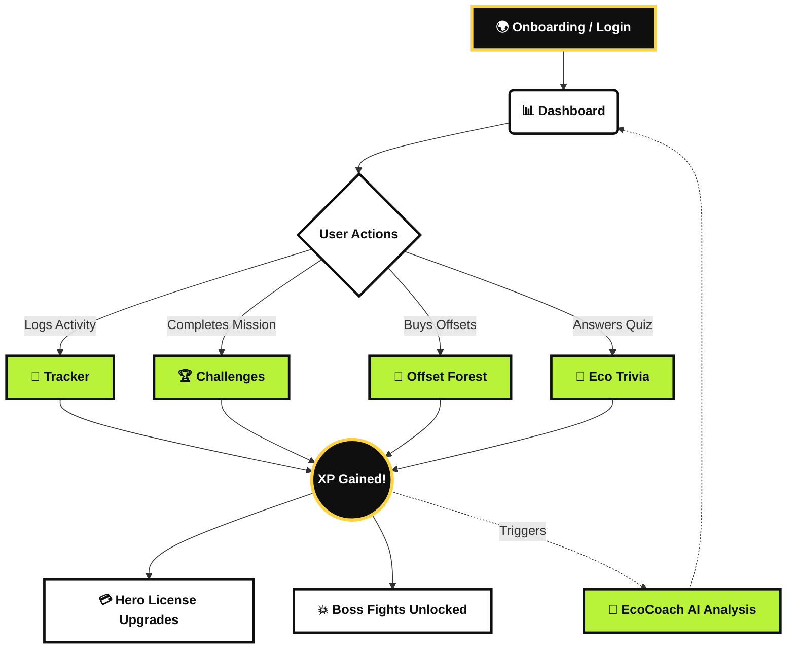

<div align="center">
  
</div>

<div align="center">
  
  [](https://react.dev)
  [](https://vitejs.dev)
  [](https://tailwindcss.com)
  [](https://vercel.com)
  
  <h3>🌍 Understand, Track, and Reduce your Carbon Footprint 🌍</h3>
</div>

<br />

## 📖 Overview

**CarbonTrace** is a highly interactive, beautifully designed carbon footprint tracker built for **Challenge 3**. Unlike boring spreadsheets or generic trackers, CarbonTrace utilizes a striking **Neo-Brutalist UI**, aggressive gamification, and AI-driven insights to make saving the planet genuinely engaging.

---

## ✨ Core Features

| Feature | Description | Status |
| :--- | :--- | :---: |
| 📊 **Dynamic Dashboard** | Real-time calculation of your emissions vs. offsets with animated progression. | 🟢 |
| 📝 **Smart Tracker** | Log daily activities (Transport, Diet, Energy) to track your exact footprint. | 🟢 |
| 🤖 **EcoCoach AI** | Simulated AI that analyzes your logging trends and provides actionable advice. | 🟢 |
| 💥 **Boss Fights** | Use your accumulated XP to battle Eco-Villains like *Smogzilla* and *King Coal*. | 🟢 |
| 💳 **Hero License** | A 3D-tilt, interactive trading card that proves your rank and displays badges. | 🟢 |
| 🧠 **Eco Trivia** | Earn bonus XP by answering climate-related trivia questions. | 🟢 |

---

## 🗺️ Application Architecture & User Flow



---

## 🎨 Design Philosophy (Neo-Brutalism)

CarbonTrace rejects the overused, soft "glassmorphism" aesthetic in favor of **Neo-Brutalism**. 

<details>
<summary><b>Click to expand our Style Guide!</b></summary>

- **Bold Colors:** Harsh yellows (`#FFD23F`), vibrant pinks (`#FF6B9E`), and toxic limes (`#B8F239`).
- **Heavy Borders:** Thick `4px` solid black borders on all interactive elements.
- **Offset Shadows:** Hard `4px 4px 0 #0F0F0F` box-shadows instead of blurred drop shadows.
- **Typography:** *Space Grotesk* for aggressive, highly-legible headers and *Outfit* for crisp body text.
</details>

---

## 🚀 Getting Started

### Prerequisites
Make sure you have [Node.js](https://nodejs.org/) installed on your machine.

### Installation

1. **Clone the repository**
   ```bash
   git clone https://github.com/Prem759-0/Challenge-3-Carbon-Footprint.git
   cd Challenge-3-Carbon-Footprint
   ```

2. **Install dependencies**
   ```bash
   npm install
   ```

3. **Start the development server**
   ```bash
   npm run dev
   ```

4. **Open your browser**
   Navigate to `http://localhost:5173` to see the magic.

---

## ⚡ Deployment

This project is configured and ready to be instantly deployed to **Vercel**.
```bash
npx vercel login
npx vercel
```
A `vercel.json` file is already included to handle routing and build outputs correctly.

---

<div align="center">
  <p>Built with ❤️ for a Greener Future.</p>
  
</div>
